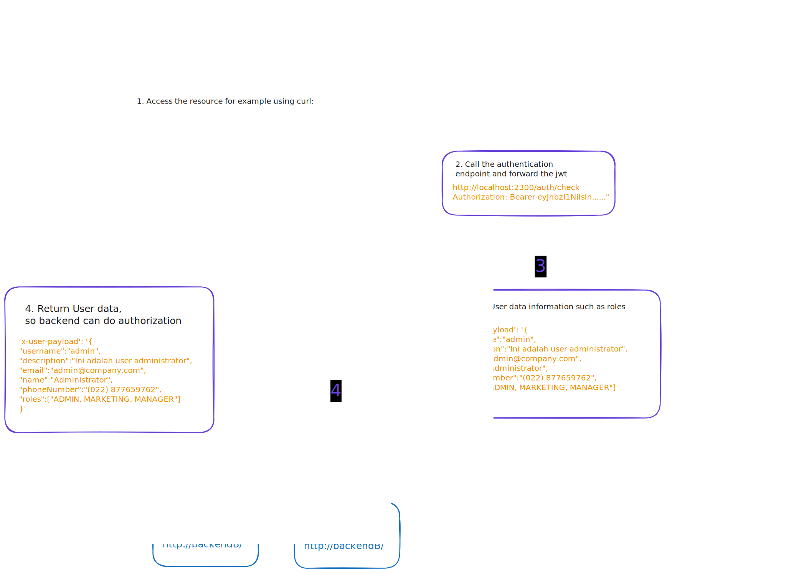

# Kong Auth Integration (Kong Plugin)



The idea is to get information about behind the scenes of access token, so before access the resources, you need to add jwt token, then token will pass to the 3rd party application then the return of the **BODY** will attach to the request in backend service, it can be in two ways:
- Authorization Headers
- Cookie ( if you implement CSRF protection, you might be attach automatically the access token)

### What's the parameter

- `token_header` name of the header which hold access token
	- type: **string**
	- default: **Authorization**
- `cookie_name` name of the cookie of which hold the access token
  - type: **string**
  - default: **access-token**
- `authentication_endpoint` url of the 3rd party authentication service
	- type: **URL**
	- required: **true**
	- method: **GET**

### What's the headers which attached into the request

payload body will attach in:
- headers `X-User-Payload`

## How to Install
For this example we used docker to install
### Build the docker Images
```bash
docker build -f ./Dockerfile -t zulfikar4568/kong-gateway .
```

### Start the Database
```bash
docker network create kong-quickstart-net
docker run -d --name "kong-quickstart-database" --network="kong-quickstart-net" -e "POSTGRES_DB=kong" -e "POSTGRES_USER=kong" -e "POSTGRES_PASSWORD=kong" postgres:13
```

### Migrate database to kong
```bash
docker run --rm --network=kong-quickstart-net \
 -e "KONG_DATABASE=postgres" \
 -e "KONG_PG_HOST=kong-quickstart-database" \
 -e "KONG_PG_USER=kong" \
 -e "KONG_PG_PASSWORD=kong" \
 -e "KONG_PASSWORD=test" \
zulfikar4568/kong-gateway kong migrations bootstrap
```

### Run kong gateway using Docker
```bash
docker run -d --name=kong-gateway \
  --network=kong-quickstart-net \
	-e "KONG_DATABASE=postgres" \
	-e "KONG_PG_HOST=kong-quickstart-database" \
	-e "KONG_PG_USER=kong" \
	-e "KONG_PG_PASSWORD=kong" \
	-e "KONG_ADMIN_LISTEN=0.0.0.0:8001, 0.0.0.0:8444 ssl" \
	-e "KONG_PROXY_ACCESS_LOG=/dev/stdout" \
	-e "KONG_ADMIN_ACCESS_LOG=/dev/stdout" \
	-e "KONG_PROXY_ERROR_LOG=/dev/stderr" \
	-e "KONG_ADMIN_ERROR_LOG=/dev/stderr" \
	-e "PATH=/usr/local/sbin:/usr/local/bin:/usr/sbin:/usr/bin:/sbin:/bin" \
	-e "KONG_VERSION=" \
	-e "KONG_PREFIX=/usr/local/kong" \
  -p 8000:8000 \
  -p 8001:8001 \
  -p 8002:8002 \
  -p 8003:8003 \
  -p 8004:8004 \
  zulfikar4568/kong-gateway
```

### Setup the Application
#### Run the simple app
This application will return all headers, and this app will run in port `3700`
```bash
cd example/simple-app
yarn start
```

#### Run the Authentication Service
You can use this template as [authentication service](https://github.com/zulfikar4568/nest-boilerplate). Change the `.env.example` to `.env`
```bash
# Running the dependencies
docker-compose up -d --build

# Migrate the DB
yarn && yarn db:migrate
yarn prisma:sync
yarn db:seed

# Running the app in dev mode
yarn dev
```

### Use plugin in services
```bash
curl -X POST http://localhost:8001/services \
  -H "Content-Type: application/json" \
  -d '{"name": "example-service", "host": "host.docker.internal", "port": 3700, "path": "/"}'

curl -X POST http://localhost:8001/services/example-service/routes/ \
  -H "Content-Type: application/json" \
  -d '{"name": "example-route", "paths": [ "/" ], "protocols": [ "http", "https" ], "methods": [ "GET", "PUT", "PATCH", "POST", "DELETE", "OPTIONS", "HEAD", "TRACE", "CONNECT" ]}'

curl -X POST http://localhost:8001/services/example-service/plugins \
   --data "name=kong-auth-integration" \
   --data config.token_header=Authorization \
	 --data config.cookie_name=access-token \
   --data config.authentication_endpoint=http://host.docker.internal:4500/api/v1/session/me
 ```

 ### Try the Plugin
 * Access the `localhost:4500/openapi` then login the user `/api/v1/session` so you will get the `access-token`
 * Try access the `localhost:8000`, you need to pass the token in `Authorization Bearer eyj8odk34...`, and you will get the `X-User-Payload` headers same as body from `http://localhost:4500/api/v1/session/me`.
